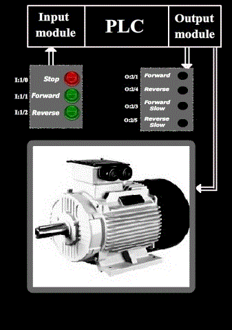
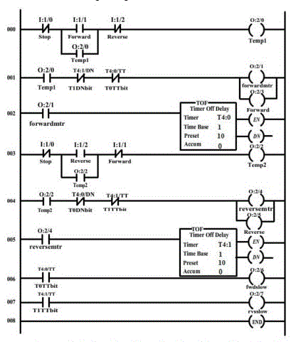
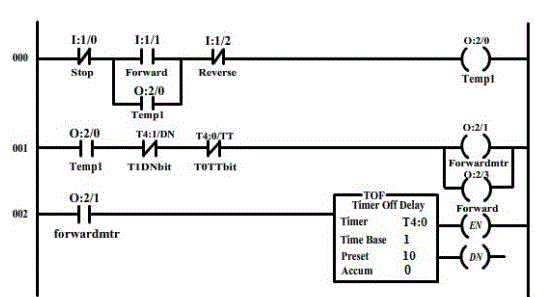
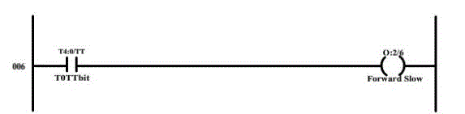
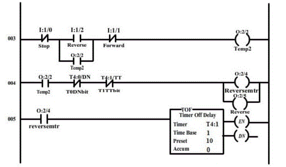
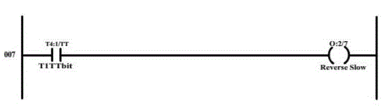
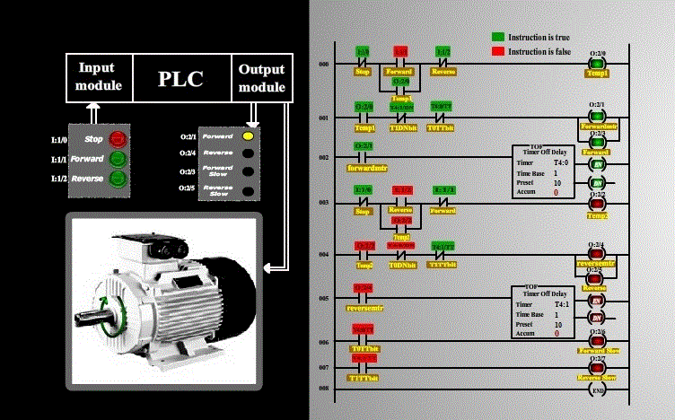
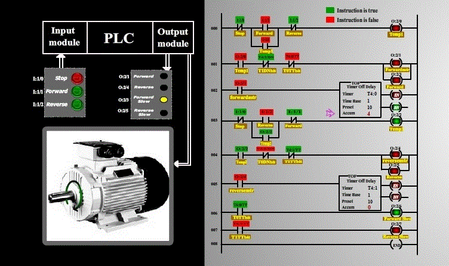
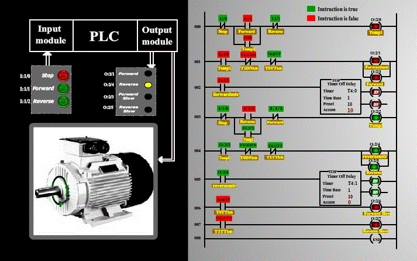

### Procedure

In our experiment, we wish to change the direction of motor rotation by click of a push button, using a PLC.  
Let us see the basic diagram of the circuitry:  

 

#### Ladder logic design :

Now, let us see how the ladder logic of motor forward and reverse direction control is implemented using a PLC. 

<ul type=disc style="text-align: justify;">
<li>Inputs to the PLC are:
<ul style="text-align: justify;">
<li>Stop ( normally open push button )  </li>
<li>Forward (normally open push button )  </li>
<li>Reverse (normally open push button )  </li>
</ul> 

</li>

<li>Outputs to the PLC are:
<ul style="text-align: justify;">
<li>Motor forward circuit  </li>
<li>Motor reverse circuit   </li>
<li>Forward (LED)   </li>
<li>Reverse (LED)   </li>
<li>Forward slow (LED)   </li>
<li>Reverse slow (LED)   </li>
</ul>
</li>
 
<strong><u>Note</strong></u> : Motor forward circuit (forwardmtr) and Motor reverse circuit (reversemtr) is a circuit, which is connected to the motor, which changes the supply polarity , which is fed to the motor. In return, changes the direction of motor rotation.

 
 

<li>Since the inputs and outputs are less, 8-point input module and 8 point output module is sufficient, where CPU resides in slot 0, input module resides in slot 1 and output module in slot 2. </li>
 

<li>Let us assign the address for the input and output signals of the PLC:   
<ul style="text-align: justify;">
<li>Stop (normally open push button ) : I:1/0  </li>
<li>Forward (normally open push button) : I:1/1  </li>
<li>Reverse (normally open push button) : I:1/2  </li>
<li>Temp1(temporary variable) : O:2/0  </li>
<li>forwardmtr ( Motor forward circuit ) : O:2/1  </li>
<li>Temp2(temporary variable) : O:2/2  </li>
<li>Forward (LED) : O:2/3  </li>
<li>reversemtr (Motor reverse circuit ) : O:2/4  </li>
<li>Reverse (LED) : O:2/5  </li>
<li>Forwardslow (LED) : O:2/6  </li>
<li>Reverseslow (LED) : O:2/7 </li>
</ul>
</li> 

<li>Let us see its ladder logic diagram: 

</ul>

<strong><u>Note</strong></u> : Here, the motor’s breaking is natural breaking. So when the motor’s direction in changed, it cannot instantly change its direction. When motor’s supply is cut down, it will have a natural breaking, during which its speed reduces and finally comes to rest. Our assumption is that, the motor takes 7 seconds to completely stop. So when the motor is instructed to change direction by the user, PLC cuts off its supply, till it comes to rest and then, it changes its direction, using the direction changing circuits ( forwardmtr, reversemtr ) . In order to be on the safer side, an off-delay timer of 10 seconds ( greater than 7 seconds) is used, to activate the motor direction changing circuits.

<ol type="a" >
<li> 

The above rungs are used for the forward motor direction rotation. 

</li> 

<li> 

The above rung is executed when the motor is instructed to change direction from forward to reverse, or from forward to stop. 

</li> 

<li> 

The above rungs are used for the reverse motor direction rotation. 

</li> 

<li> 

The above rung is executed when the motor is instructed to change direction from reverse to forward, or from reverse to stop. 

</li>

</ol>

The following screen shots explain the operation:

The above screen shot represents the condition when the motor is running forward. 

The above screen shot represents the condition when the reverse push button is pressed while the motor was running in forward direction, and the motor starts braking before it starts revolving in reverse direction. 

The above screen shots represents the condition when the motor is running in reverse direction.
