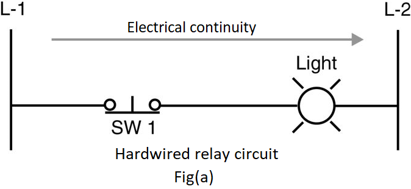
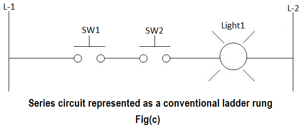
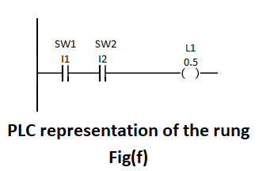
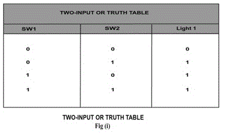
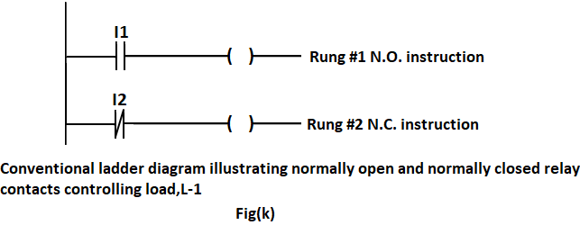
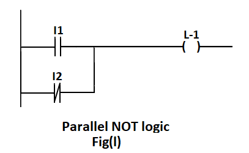
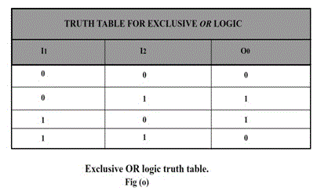
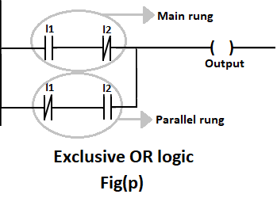

### Introduction

### Introduction To Logic :

A   hardwired   control   circuit   can   be   represented   by   conventional hardwired relay ladder diagram. In any hardwired circuit, there should be electrical continuity in order for the load to energize.

#### Basics about conventional ladder and PLC ladder logic :

Electrical sequence of operation in hardwired relay circuits can be represented by electrical ladder diagram. Ladder diagram shows the interconnection of field devices. In the ladder diagram, each rung shows how a field device is turned on and also shows how it interacts with next field devices. 
The difference between a PLC ladder program and relay ladder rungs is the  continuity.  In  an  electrical  rung  diagram,  there  is  an  electrical continuity only when the current flows from left power rail to right power rail.

 

Fig (a), shows electrical continuity when SW 1 is closed, as the current flows from L-1 to L-2 energizing the load. 
Even though PLC ladder logic was modeled after the conventional relay ladder, there is no electrical continuity in PLC ladder logic. PLC ladder rungs should have logical continuity in order for the output to energize. PLC ladder program uses familiar terms like "rungs" and "normally open" and	"normally  closed"  contacts,  but  the  relay  ladder  logic  has  no electrical continuity between an input and the controlled output. 

<strong>Note</strong>:- There  is  no  physical  conductor  that  carries  the  input  signal through to the output. 
Each rung in a ladder diagram is a program statement. This program statement consists of a condition or sometimes conditions, along with some type of action. Inputs are the conditions, and the action, or output, is the result of the conditions. 

As in case of physical wiring hardware devices connected in series or parallel, PLC also combines ladder program instructions in series or parallel. However, rather than working in series or parallel, the PLC
combines instructions logically using logic operators. Logical operations performed by PLC are nothing but fundamental logic operation, using fundamental logic operators like: AND, OR, and NOT. These operators are used to combine the instructions on a PLC rung so as to make the outcome of each rung either true or false.

#### The AND-logic function :

 The series circuit of 2 switches can be looked as an AND logic function. In fig (b) and fig (c), both switch1 and switch2, must be closed to have electrical continuity. W hen  there is  electrical continuity, output  (light1) will energize. Hence the keyword here is AND. 

The circuit in fig (b) is represented as a schematic diagram ladder rung in fig (c). 

When the switch1 and switch2 is closed, electrical continuity is established to L-2. This is shown in fig (d).

 The various possible switch combinations are shown in the truth table below. 

Table 1: Truth table for AND logic 

 Fig (d) can be written in PLC ladder format as shown in the figure below 

 
Here is the program listing for a typical PLC, if you are entering the program with a handheld programmer.  
LOAD I1 
AND I2 
OUT O5

The above instruction tell the processor to load input 1 (I1) into memory, AND it with input 2 (I2) and then output the result to output 5 (O5). The resulting output will be based on the truth table fig (e).

#### The OR-logic function :

In an OR - LOGIC function, the output is true if any input is true. The OR logic also states that if all inputs are true, the output will be true. 

 

In the above figure, if switch1 OR switch2 is energized then light1 will energize. Also, if both SW 1 and SW2 are true, the output will also be true.  
Fig (g) is converted to PLC ladder rung and it looks like fig (h) 

A PLC rung of logic will have normally open or normally closed contacts instead of normally open or normally closed switch symbols. Addresses and instructions are included. Here, in additions to each contact and its address, text information such as SW1, SW2 and L-1 is used and they are  referred  to  as  instruction comments.  These  instruction comments can be added from programming software.

Table 2: Truth table representing two-input OR function 

 

#### The NOT-logic function :

A normally closed relay contact passes power any time when the relay coil  is  not  energized. In  the  same manner, the  normally closed PLC ladder logic instruction will pass power any time when the input status file bit associated is  not a  1. In this condition, the physical hardware input is not sending an input signal into the PLC's input module. The opposite of normally open PLC instruction or contact is the NOT logic. NOT logic can be used in conjunction with AND or OR logic, when a logical 0 in the status file is expected to activate some output device. In other words, NOT logic is used when an input is not energized i.e., 0 in the associated status bit, the output should be energized. Also, when the input is energized i.e., 1 in the associated status bit, the output should not be energized.

Table 3: Truth table for NOT function 

 

 

##### Analysis of rung 1 :

When I1 is true i.e. the input status file bit regarding I1 is true (1), the instruction I1 will energize the output. The instruction I1 is considered true when it passes logical continuity. If there is no valid input signal from the field input devices attached to I1's screw terminal on the input module, a logical 0 will be placed in the associated input status file bit. A logical 0 in the input status file will make the normally open input instruction to become false. When normally open instruction is false, it will not pass logical continuity.

##### Analysis of rung 2 :

The normally closed instruction works	much like normally closed contacts on a hardware relay. In the fig (k), when the normally closed instruction I2 is true, i.e. the associated status file bit has a valid zero (0), logical	continuity  is established to energize the output. When the associated status file bit has valid 1, the NC instruction goes false and there is no logical continuity and the output is not energized.

#### The PARALLEL NOT- logic function :

 
PLC ladder rung has 2 input instructions, one normally open and the other one is normally closed. This circuit contains parallel NOT logic. This schematic rung will be true under the conditions shown in the truth table below.  
Table 4: Input and output relation of a parallel NOT function. 

 

Output L-1 will be energized only when input1 must be true OR input2 must not be true. 

 

#### The EXCLUSIVE OR-logic function :
 Table 5: Input and output relation of an exclusive OR function. 

 
Ladder rung of EXOR GATE would look like this 

 

##### Case 1 : :

When I1 = 0 and I2 = 0: 
Let us analyze main rung. When I1 = 0, the normally open instruction is false and, normally closed instruction is true, but since normally open instruction is false, there is no logical continuity and output cannot be energized. Similar analysis can be done in parallel rung, normally closed instruction will be true and normally open instruction will be false and output is not energized.

##### Case 2 :

When I1= 0 and I2 = 1: 
In main rung, normally open instruction will be false and, normally closed instruction will be true, but since there is no logical continuity this rung logic cannot energize the output. But, in parallel rung, normally closed instruction will be true, as well as normally open instruction will also be true, hence there is logical continuity, and output is energized.

##### Case 3 :

When I1 = 1 and I2 = 0: 
This case is similar to case 2, only the role of inputs are interchanged i.e. here main rung is true and energizes the output and parallel rung is false.

##### Case 4 :

When both inputs are true, the main ladder rung as well as the parallel ladder rung goes false. In main rung, normally open instruction is true but normally closed instruction is false. Hence, there is no logical continuity.    In parallel ladder rung, normally closed instruction is false and normally open instruction is true, and here also there is no logical continuity. Hence, the output is not energized.

